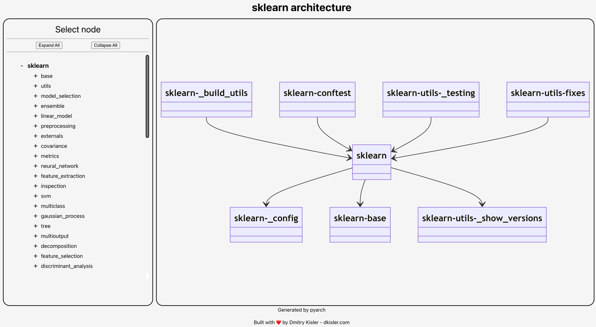

# pyarch

The tool to generate dynamic [class diagrams](https://mermaid.js.org/syntax/classDiagram.html) of python packages to
facilitate their development and maintenance.

**Motivation**:

- Reduction of the cognitive load when learning the structure of a new package.
- Identification of architecture bottlenecks using static analysis of inter-modular dependencies.

## Demo

- [sklearn](https://www.dkisler.com/pyarch/sklearn)
- [SuperDuperDB](https://www.dkisler.com/pyarch/superduperdb)
- [Sanic](https://www.dkisler.com/pyarch/sanic)
- [FastAPI](https://www.dkisler.com/pyarch/fastapi)

## GitHub Action

Pyarch can be executed as part of GitHub workflow.

### Inputs

| Attribute | Description                            | Required | Default                                                                                                                          |
|:----------|:---------------------------------------|:--------:|:---------------------------------------------------------------------------------------------------------------------------------|
| `input`   | Directory with the package source code |   true   |                                                                                                                                  |
| `output`  | Directory to save generated HTML file  |  false   | `.pyarch/output`                                                                                                                 |
| `title`   | Custom HTML title                      |  false   | `Python package architecture`                                                                                                    |
| `header`  | Custom HTML header                     |  false   | `Python package architecture`                                                                                                    |
| `footer`  | Custom HTML footer                     |  false   | `<p style="font-size:15px">Built with ❤️ by <a href="https://www.dkisler.com" target=_blank>Dmitry Kisler - dkisler.com</a></p>` |

### Outputs

- `output`: Path to generated HTML file.

### Example: deployment of the package architecture diagram to GitHub Pages

The following GitHub workflow can be used to generate the package architecture diagram and to publish it using GitHub
pages.

```yaml
name: "Pyarch Pages"

on:
  workflow_dispatch:

permissions:
  contents: read
  pages: write
  id-token: write

concurrency:
  group: "pages"
  cancel-in-progress: false

jobs:
  pyarch-pages:
    runs-on: ubuntu-20.04
    steps:
      # assumption: the workflow is running in the python package repo
      - uses: actions/checkout@v3
        with:
          fetch-depth: 0

      - name: Generate HTML
        uses: kislerdm/pyarch@v0.0.2
        with:
          # Change to the path with the package's source files
          input: src
          title: "Architecture of my package"
          header: "Architecture of my package"
          output: public

      - name: Setup Pages
        uses: actions/configure-pages@v3
      - name: Upload artifact
        uses: actions/upload-pages-artifact@v2
        with:
          path: 'public'
      - name: Deploy to GitHub Pages
        id: deployment
        uses: actions/deploy-pages@v2
```

## Standalone

### How to install

**Prerequisites**:

- python >= 3.8

**Steps**

1. Download the latest release of the python script
2. Move it to the bin directory `/usr/local/bin`
3. Run the script to validate the version:

```commandline
pyarch --version
```

_Note_ that sudo permissions will be required. Alternatively, the script can be executed without the `step 2`:

```commandline
python3 pyarch --version
```

**Demo**

_Note_ [curl](https://curl.se/) is required.

```commandline
sudo curl -SLo /usr/local/bin/pyarch https://github.com/kislerdm/pyarch/releases/download/v0.0.1/pyarch &&\
pyarch --version
```

Output:

```commandline
version: 0.0.1
```

### How to use

**Prerequisites**:

- pylint
- pyarch

Follow the steps to generate the webpage with dynamic architecture diagrams of [sklearn](https://scikit-learn.org/):

1. Create a clean directory

```commandline
mkdir sklearn-diagram && cd sklearn-diagram 
```

2. Clone sklearn from GitHub to the local repository:

```commandline
git clone git@github.com:scikit-learn/scikit-learn.git code
```

3. Generate the package architecture diagrams as UML
   using [pyreverse](https://pylint.readthedocs.io/en/latest/pyreverse.html)

```commandline
pyreverse -Akmy -o puml -d . --ignore=test,tests code/sklearn
```

4. Generate the webpage with the dynamic diagrams:

```commandline
pyarch -i . -o . -v --title="sklearn architecture" --header="sklearn architecture"
```

The directory is expected to have the following structure:

```commandline
.
├── code
├── classes.puml
├── packages.puml
└── index.html
```

Open `index.html` using a web-browser:



## Distribution and contribution

The project is distributed under the MIT license - feel free to use it as you will.

Please open github issue, and/or PR with a change proposal to collaborate.
